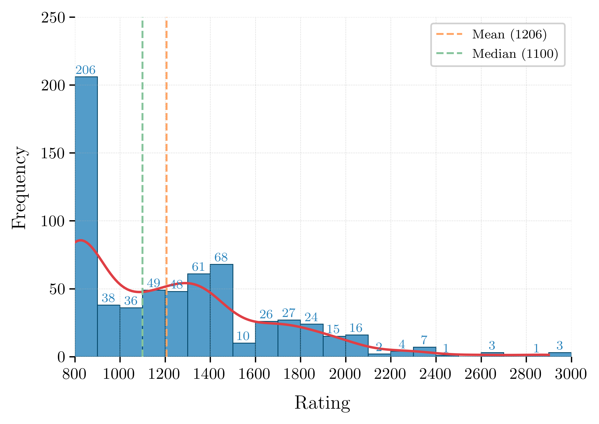

<table>
  <tr>
    <td style="width: 35%; text-align: center;">
      
    </td>
    <td style="width: 65%; text-align: left;">
      <h1>CoCoClaNeL Dataset: Code Correctness Classification w.r.t. Natural Language Requirements</h1>
    </td>
  </tr>
</table>

---

## CoCoClaNeL Dataset

**CoCoClaNeL** (short for **Co**de **Co**rrectness **Cla**ssification with respect to **N**atural **L**anguage) is a dataset of Python programs paired with natural language problem descriptions, labeled as correct or incorrect. The dataset is designed for evaluating the ability of Large Language Models (LLMs) to reason about program correctness in real-world contexts.

This repository is part of the **HoarePrompt** project and contains the full dataset used in our experiments and tool development.

---

## Dataset Motivation

While several datasets of natural language programming problems exist (e.g., MBPP, CodeFlaws), many are unsuitable for correctness reasoning due to:
- High risk of **data leakage**, as many models may have seen them during training.
- **Trivial implementations** or synthetic tasks.
- Lack of **subtle, realistic bugs**.

To address this, we constructed **CoCoClaNeL**, which includes:
- Challenging problems from **Codeforces contests (Jan–Jun 2024)**.
- Real user submissions labeled using Codeforces’ internal testing system.
- **Balanced distribution**: 645 problem-solution pairs, with 322 incorrect programs (49.9%).

---

## Dataset Collection Method

To ensure difficulty and real-world relevance:
- We crawled recent Codeforces problems and Python submissions.
- Accepted submissions were marked as **correct**.
- Incorrect submissions were selected as those just before an accepted one.


All problems were parsed from raw HTML into **Markdown**, including:
- Problem description
- Input/output format
- Examples
- Notes

---

## Submission Selection Strategy

For each problem:
- Include up to **three incorrect/correct pairs** from the same user.
- Include **one ~50% pass rate** submission (if available).
- Include **one with a single failing case** (if available).
- Skip problems with no correct submission.
- Try to select the final submission before a correct one (it will probably contain difficult to identify bugs)

---

## Problem Difficulty

We use the **Codeforces rating** system as a difficulty indicator. The average problem rating in the dataset is **1206**. According to CodeElo statistics, only 2 out of 33 tested LLMs achieve performance at this level.

<div align="center">
  
</div>

Lower-rated problems are more common due to greater participant engagement and more available submissions.

---

## Dataset Format

Each example contains:
- `"description"` – the problem in Markdown.
- `"generated_code"` – the Python program.
- `"correct"` – `true` or `false` based on Codeforces verdict.
- `"task_name"` – the Codeforces problem ID.
- `"unique_id"` - A unique identifier for this entry of the dataset
- `"counterexample"` – optional, when the program fails for specific input.
- `"LOC"` – lines of code.
- `"hard"` – problem rating.
- Other metadata fields (`model`, `task_id`, etc.)

---

## Files in this Repository

```
CoCoClaNeL/
├── CoCoClaNeL_experiments.json  # 645 examples used in HoarePrompt evaluation
├── CoCoClaNeL_pilot.json        # 140 pilot examples used for tool development
├── CoCoClaNeL_total.json        # Combined file (experiments + pilot)
├── assets/
│   └── rating_distribution.png  # Rating distribution chart
```

- `CoCoClaNeL_experiments.json` is the main dataset used in the HoarePrompt paper.
- `CoCoClaNeL_pilot.json` was used for calibration and debugging.
- `CoCoClaNeL_total.json` combines both, for full analysis or retraining.

---

## Intended Use

This dataset is designed to:
- Benchmark LLMs on real-world correctness reasoning.
- Support research in code verification, program understanding, and fault localization.
- Provide a realistic, leakage-safe benchmark beyond synthetic or trivial tasks.

---

## Related Projects

1. **[HoarePrompt (Main Repo)](https://github.com/msv-lab/HoarePrompt)**  
   The core implementation of HoarePrompt, including classifiers and structural reasoning logic.

2. **[HoarePrompt-data](https://github.com/msv-lab/HoarePrompt-data)**  
   Contains experimental results and metrics derived from CoCoClaNeL and other benchmarks.

3. **[HoarePrompt-experiments](https://github.com/msv-lab/HoarePrompt-experiments)**  
   Scripts and configs to automate LLM evaluation over the CoCoClaNeL dataset.

4. **[CoCoClaNeL](https://github.com/msv-lab/CoCoClaNeL)**  (This is the current repo you are on) 
   This repository: the dataset and associated documentation.

---

## License

This dataset is released under the **MIT License**.  
See the [LICENSE](./LICENSE) file for details.

---

